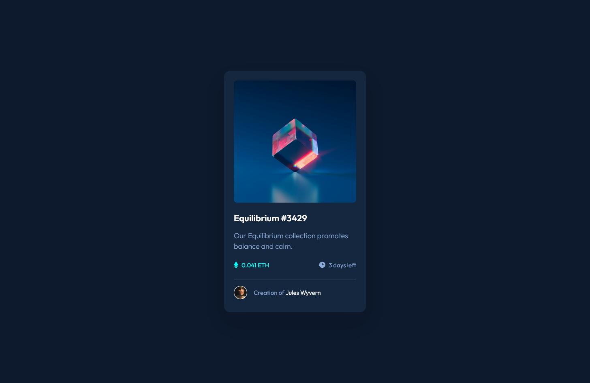
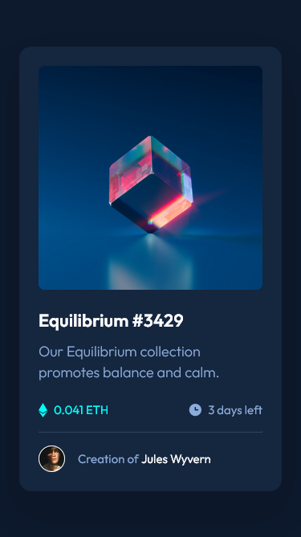

# Frontend Mentor - NFT preview card component solution

This is a solution to the [NFT preview card component challenge on Frontend Mentor](https://www.frontendmentor.io/challenges/nft-preview-card-component-SbdUL_w0U). Frontend Mentor challenges help you improve your coding skills by building realistic projects. 

## Table of contents

- [Overview](#overview)
  - [The challenge](#the-challenge)
  - [Screenshot](#screenshot)
  - [Links](#links)
- [My process](#my-process)
  - [Built with](#built-with)
  - [What I learned](#what-i-learned)
  - [Continued development](#continued-development)
  - [Useful resources](#useful-resources)
- [Author](#author)
- [Acknowledgments](#acknowledgments)

**Note: Delete this note and update the table of contents based on what sections you keep.**

## Overview

### The challenge

Your challenge is to build out this preview card component and get it looking as close to the design as possible.

You can use any tools you like to help you complete the challenge. So if you've got something you'd like to practice, feel free to give it a go.

Your users should be able to:

- View the optimal layout depending on their device's screen size
- See hover states for interactive elements

### Screenshot

#### Desktop view

#### Tablet view

#### Mobile view

### Links

- [Solution URL](https://github.com/fmanimashaun/skilled-elearning-landing-page)
- [Live Site URL]( https://fmanimashaun.github.io/skilled-elearning-landing-page/)

## My process

### Built with

- [HTML](https://developer.mozilla.org/en-US/docs/Web/HTML)
- [CSS](https://developer.mozilla.org/en-US/docs/Web/CSS)
- [JavaScript/ES6](https://262.ecma-international.org/6.0/)
- [Git](https://git-scm.com/)
- [GitHub](https://github.com)
- [Figma](https://www.figma.com/)
- [webpack 5](https://webpack.js.org/)
- [sass](https://sass-lang.com/)

### What I learned

Basically, I worked to reinforced my knowledge of interpreting UI/UX design and implemeenting the  layout as close as possible to the design.

### Continued development

I will still want to focus on reinforcing my understanding of various layout implementation while learning javascript for use in future projects

### Useful resources

------

## Author

👤 **Engr. Animashaun Fisayo**

- [GitHub](https://github.com/fmanimashaun)
- [Twitter](https://twitter.com/fmanimashaun)
- [LinkedIn](https://www.linkedin.com/in/fmanimashaun/)
- [Website](https://fmanimashaun.com)
- [Blog](https://blog.fmanimashaun.com)

## Acknowledgments

------
